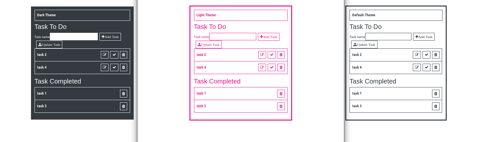

# Getting Started with Create React App

This project was bootstrapped with [Create React App](https://github.com/facebook/create-react-app).

## Project Description

This project is a simple todo list using styled-components to style each component. Life cycle ComponentDidUpdate was used to update each task. When user click on the icon check in task to do, it will move the task to task completed. When user click the icon trash, task item will be deleted.

## Available Scripts

In the project directory, you can run:

### `yarn start`

Runs the app in the development mode.\
Open [http://localhost:3000](http://localhost:3000) to view it in the browser.

## Project view

